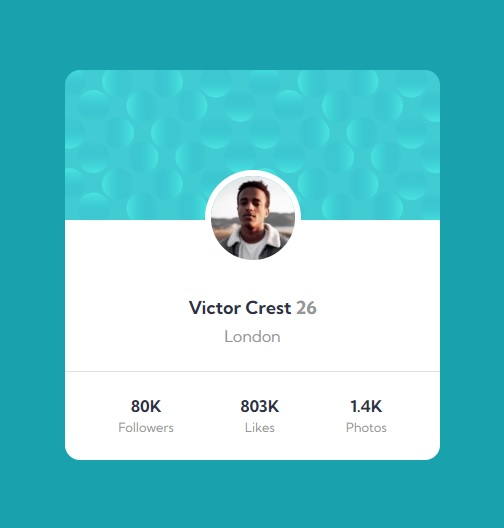

# Frontend Mentor - Profile card component solution

This is a solution to the [Profile card component challenge on Frontend Mentor](https://www.frontendmentor.io/challenges/profile-card-component-cfArpWshJ). 

- Creation Date: 2 April 2022

## Table of contents

- [Screenshot](#screenshot)
- [Links](#links)
- [Future Development](#future-development)
- [Author](#author)
- [Date](#date)

## Screenshot

## Links

- Solution URL: [Solution](https://www.frontendmentor.io/solutions/profile-card-component-r1rKaGSXq)
- Live Site URL: [Live](https://ethenpage.github.io/Profile-Card-Component/)

## Future Development

- Work with responsive background.

## Author

- Name: Mirza Ethen (Mirza Monirul Alam).
- Frontend Mentor - [@EthenPage](https://www.frontendmentor.io/profile/ethenpage)

## Date

- 2 April 2022.
